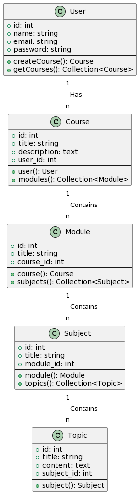

# Plataforma de Cursos 

## Descripción del Proyecto

Aplicación web desarrollada en Laravel que permite a los usuarios crear, compartir y participar en cursos educativos. La plataforma organiza los cursos en módulos y materias, proporcionando una estructura flexible para una variedad de temas educativos.

Todo el software que he desarrollado desde que soy chico ha sido pura y exclusivamente para brindar soluciones a problemas de mi dia a dia, esta no es una excepcion.

Particularmente desarrollo esta pagina dado a la cantidad de pdfs que tengo para cada materia que curso en la facultad, y me gustaria poder tenerlos bien organizados en una pagina web y a su vez poder compartirles a cada uno de mis compañeros dicha informacion y que a su vez ellos puedan cargar los suyos

</img>

## Caracteristicas a futuro

- **Registro y Autenticación de Usuarios:**
  - Los usuarios pueden registrarse, iniciar sesión y gestionar sus cursos.

- **Creación de Cursos:**
  - Los usuarios pueden crear cursos educativos y estructurarlos en módulos y materias.

- **Navegación por Módulos y Materias:**
  - Los cursos están organizados en módulos y materias para una fácil navegación.

- **Subida de Contenido Multimedia:**
  - Los instructores pueden cargar archivos multimedia, como videos y documentos, para cada tema del curso.

- **Interacción en Cursos:**
  - Los estudiantes pueden comentar en los cursos, calificarlos y marcar favoritos.
